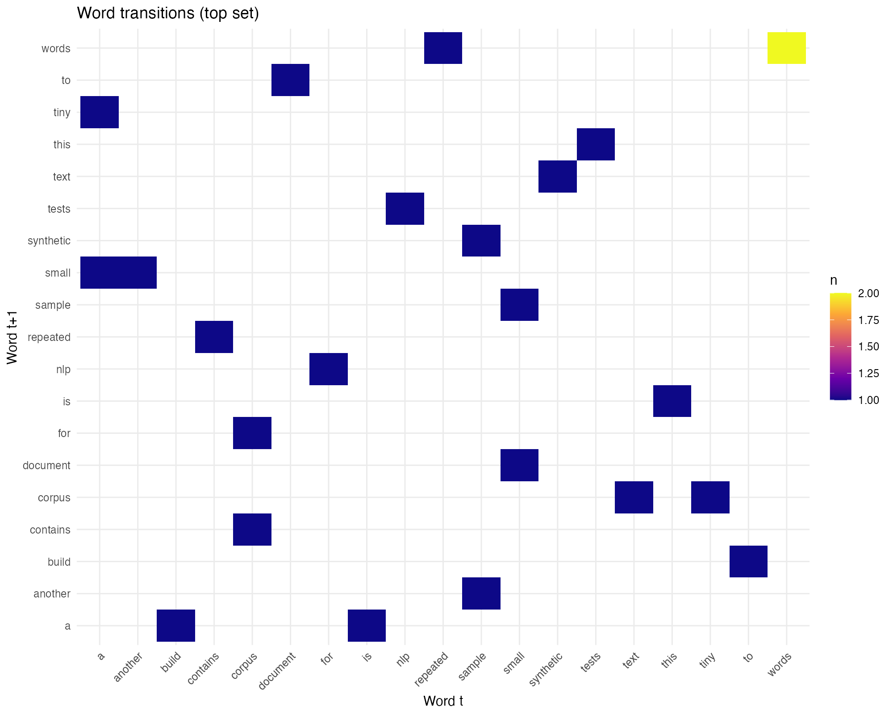
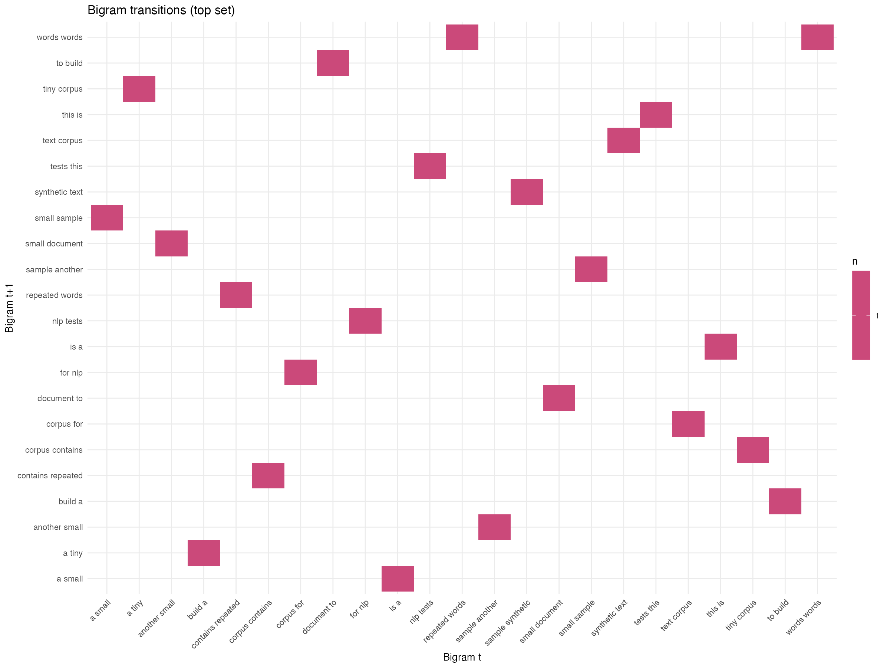

AI Vertical (Synthetic Individual-Level) — Replication Outputs

This project reproduces, one‑for‑one, the output files of the reference project at `AI paper`, with the key difference that the underlying data here are simulated at the individual level and then aggregated to team level. The pipeline generates the same filenames, directory structure, and types of figures/tables so downstream documents and workflows can be reused unchanged.


## Overview
- Purpose: Produce the exact same outputs as the reference “AI paper” project while sourcing data from a synthetic individual‑level generator.
- Data model: Individuals are simulated per team, then aggregated to team‑level metrics that mirror the original survey‑based dataset.
- Reproducibility: A single master script orchestrates all steps; configuration lives in `config/config.yml` for easy tuning.


## Repository Layout
- `code/R code/`
  - `master.R`: Orchestrates the full pipeline and logging.
  - `cleaning.R`: Simulates individual‑level data and aggregates to team level.
  - `reproduction rates.R`: Reproduction/error difference figures and raw series.
  - `prompt distribution.R`: Kernel‑style density plots for prompts/files/images/words.
  - `error shares.R`: Normalized minor/major error regressions and LaTeX output.
  - `time to first.R`: Time‑to‑first (minor/major/reproduction) figures.
  - `text figures.R`: Word frequency “cloud” and Markov heatmaps from `data/corpus`.
  - `tables_synthetic.R`: Supplemental tables to mirror reference outputs.
- `R/`
  - `simulate_individuals.R`: Synthetic individual generator and team aggregation helpers.
  - Additional helpers used by scripts (e.g., `reproduction rates.R` in R/, if present).
- `config/`
  - `config.yml`: All parameters that govern the simulation and labeling.
- `data/`
  - `AI games.rds`: Generated team‑level dataset used by all downstream scripts.
  - `corpus/`: Optional `.txt` files used to build text‑based figures.
- `output/`
  - `figures/`: All generated figures (PDF/PNG) matching reference names.
  - `tables/`: All generated LaTeX tables matching reference names.
  - `master_log_R.log`: R pipeline log.
  - `master_log_stata.log`: Placeholder for parity; no Stata pipeline runs here.
- `tests/`: Placeholder for future tests.


## How To Run
1. Open a terminal at the project root.
2. Run: `Rscript "code/R code/master.R"`
3. Outputs will appear under `output/figures` and `output/tables`; a log is written to `output/master_log_R.log`.

Notes
- The master script uses `pacman::p_load(...)` to install/load required packages automatically if missing.
- If you prefer, open an interactive R session and pre‑install packages listed under “Dependencies”.


## Quick Start (copy/paste)

From the shell:

```
Rscript "code/R code/master.R"
```

From an interactive R session:

```
# Optionally install pacman for convenient loading
if (!requireNamespace("pacman", quietly = TRUE)) install.packages("pacman")

# Run the master pipeline (assumes working directory is project root)
source("code/R code/master.R")

# Outputs will be in output/figures and output/tables
```

Regenerate outputs from a clean slate (optional):

```
unlink("output/figures", recursive = TRUE, force = TRUE)
unlink("output/tables",  recursive = TRUE, force = TRUE)
dir.create("output/figures", recursive = TRUE, showWarnings = FALSE)
dir.create("output/tables",  recursive = TRUE, showWarnings = FALSE)
Rscript "code/R code/master.R"
```


## Dependencies
Core R packages (loaded via `pacman::p_load` in `master.R`):
- Project utilities: `here`, `yaml`, `glue`
- Data wrangling: `dplyr`, `tidyr`, `stringr`, `forcats`, `janitor`, `lubridate`, `tibble`, `purrr`
- Modeling & stats: `fixest`, `sandwich`, `lmtest`, `car`, `margins`, `multcomp`, `broom`
- Tables & reporting: `kableExtra`, `modelsummary`, `xtable`
- Survival (RMST compatibility): `ggsurvfit`, `survRM2`
- Visualization: `ggplot2`, `patchwork`

The scripts will run with a recent R (≥ 4.2 recommended) and recent package versions. Some ggplot2 warnings about removed rows (due to missing values at aggregation) are expected and harmless.


## Configuration (`config/config.yml`)
Key parameters you can tune:
- `seed`: RNG seed for reproducibility.
- `n_teams`: Number of teams to simulate.
- `individuals_per_team_min`, `individuals_per_team_max`: Team sizes.
- Categorical levels: `branches`, `softwares`, `attendance`, `skills`, `gpt_levels`, `coding_levels`, and `games` (labels used for axes/legends).
- Prompt intensity: `prompts_intensity_mean`, `prompts_intensity_sd` (drives prompts/files/images/words at the individual level).
- Error and reproduction process: `error_minor_rate`, `error_major_rate`, `reproduction_base_prob`, `reproduction_ai_assisted_bonus`, `reproduction_ai_led_penalty`.
- Time modeling (minutes): `start_time_mean`, `start_time_sd` for time‑to‑first metrics.

Edit `config.yml` to change data characteristics, then re‑run the master script.


## Data Flow
1. Simulation and aggregation (`cleaning.R` + `R/simulate_individuals.R`)
   - Simulates individual records per team across games, branches, and software.
   - Individual outcomes: prompts, files, images, words; reproduction; minor/major errors; time‑to‑first events.
   - Aggregates to a team‑level dataset `data/AI games.rds` with fields such as:
     - Identifiers & labels: `team_id`, `game`, `game2`, `branch`, `software`, `attendance`, `number_teammates`, `max_skill`, `min_skill`.
     - Outcomes (team level): `reproduction` (mean of individual reproduction), `minor_errors`/`major_errors` (sums), `time2_reproduction`/`time2_first_minor`/`time2_first_major` (mins), `prompts`, `files`, `images`, `words` (sums).
     - Additional factors for parity: `max_gpt`, `min_gpt`, `max_coding`, `min_coding` (kept as factors with configured levels).

2. Figures and tables
   - Reproduction & Errors (`reproduction rates.R`): difference‑in‑means lines and raw series by branch/game; saves both overall and S1 (excludes “Virtual 2025”).
   - Prompt Distribution (`prompt distribution.R`): density plots for prompts/files/images/words (AI‑Assisted branch) in a 2×2 grid.
   - Error Shares (`error shares.R`): normalizes errors within paper, runs fixed‑effects regressions, and writes a LaTeX table.
   - Time‑to‑First (`time to first.R`): mean time to first minor/major error and reproduction by branch across games (overall and S1).
   - Text Figures (`text figures.R`):
     - Top word bar chart as a “cloud” alternative without extra dependencies.
     - Word and bigram transition heatmaps approximating Markov visualizations.
     - Sources text from `data/corpus/*.txt`.
   - Supplemental Tables (`tables_synthetic.R`): writes a suite of `.tex` files (balance, branches, prompts, softwares, gpt skill, main, logit/poisson summary, full controls s1/s2, power, rmst, study 2) to mirror the reference file list.

3. Logging
   - R log: `output/master_log_R.log`.
   - Stata log: `output/master_log_stata.log` is a placeholder for output parity.


## Outputs Produced (Parity with Reference)
- Figures (`output/figures/`):
  - `major errors.pdf`, `major errors (s1).pdf`, `major errors (raw).pdf`, `major errors (raw, s1).pdf`
  - `minor errors.pdf`, `minor errors (s1).pdf`, `minor errors (raw).pdf`, `minor errors (raw, s1).pdf`
  - `reproduction rates.pdf`, `reproduction rates (s1).pdf`, `reproduction rates (raw).pdf`, `reproduction rates (raw, s1).pdf`
  - `time2_first_major.pdf`, `time2_first_major (s1).pdf`
  - `time2_first_minor.pdf`, `time2_first_minor (s1).pdf`
  - `time2_reproduction.pdf`, `time2_reproduction (s1).pdf`
  - `prompt distribution.pdf`
  - `wordcloud_focus_groups.png`, `markov_words_focus_groups.png`, `markov_bigrams_focus_groups.png`
- Tables (`output/tables/`):
  - `balance.tex`, `branches.tex`, `branches_s1.tex`, `prompts.tex`, `softwares.tex`, `gpt skill.tex`
  - `main.tex`, `logit poisson.tex`, `full controls (s1).tex`, `full controls (s2).tex`
  - `power.tex`, `rmst.tex`, `study 2.tex`, plus `error shares.tex`
- Logs: `master_log_R.log`, `master_log_stata.log` (placeholder)


## Figure Previews

These PNGs render directly in most viewers; PDF figures are in `output/figures`.







## Customizing & Extending
- Tune `config/config.yml` to change distributions, sizes, and label sets, then re‑run the master script.
- Replace or add `.txt` files in `data/corpus` to alter the text‑based figures.
- Swap in a real individual‑level dataset: adapt `simulate_individuals.R` functions to read your data and keep the aggregation schema stable so downstream scripts remain unchanged.
- Add new outputs: follow the pattern in `master.R` to source additional scripts and save to `output/figures` or `output/tables` as needed.


## Troubleshooting
- Package install prompts: the scripts try to install missing packages; if behind a proxy/firewall, pre‑install packages in an interactive R session.
- ggplot2 warnings about “Removed rows”: expected when some games/branches lack values due to simulation or S1 filtering; visuals remain valid.
- File permissions: ensure the project has write access to `output/`.
- Stata outputs: only a placeholder log is produced; no `.do` files are run in this project.


## Provenance & Difference from Reference
- Reference project: “AI paper” uses survey team‑level data and includes Stata code.
- This project: simulates individual‑level data and aggregates to team level to mirror outputs. All filenames and directory paths are kept identical for downstream compatibility.
