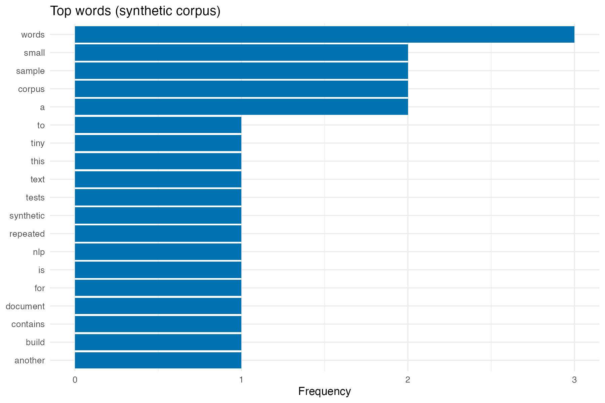
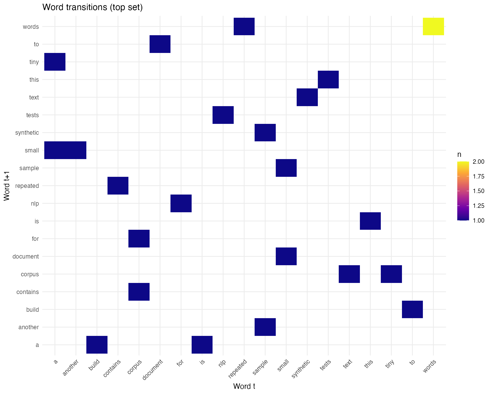

AI Vertical (Synthetic Individual-Level) — Analysis Pipeline

This project implements an individual‑level analysis pipeline aligned with the PAP “Reproducing with AI Across the Expertise Ladder.” The revised PAP now randomizes within either five expertise tiers or a collapsed three-tier grouping (undergraduate, graduate student, professor/researcher) when counts call for coarser cells. The unit of observation is the individual. We simulate individual data and analyze treatment effects of ChatGPT+ on outcomes and gaps across expertise tiers; all outputs, tables, and figures are computed at the individual level. X‑axis labels for event‑indexed figures now use generic “Game 1–5” ticks to reflect the five‑game design in the PAP. The repository also houses the accompanying paper inventory, pre‑event training materials, and focus‑group assets referenced in the study protocol. Because the study is still in its pre-analysis stage, all analysis scripts, synthetic data, and mock outputs live inside the `PAP/` workspace; the replication package and observed data will be migrated to the repository root after collection.


## Overview
- Purpose: Implement PAP-specified analyses for individual participants (no teams), covering both the five-tier ladder and the three-tier collapsed grouping now documented in the PAP.
- Data model: Individuals are simulated across events, tiers, and software; analyses use these individual records directly.
- Reproducibility: A single master script orchestrates all steps; configuration lives in `config/config.yml` for easy tuning. Usage-intensity variables rely on inverse hyperbolic sine (`asinh`) transforms of self-reported prompt/file/image/word counts, avoiding `log(1+x)` adjustments.
- Supporting assets: The repo includes the locked PAP sources plus shared materials for task inventory, pre-event training, and post-pilot focus groups.
- Current status: No observed data are stored yet—`PAP/data/` holds synthetic placeholders so the pipeline can knit tables/figures ahead of fieldwork; the eventual replication files will replace these artefacts once collection is complete.


## Repository Layout
- During the PAP phase all analysis assets remain nested under `PAP/`. Once field data are collected, the contents of `PAP/` will be promoted to the repository root so the public replication package matches the layout sketched below.
- `PAP/`
  - `pre_analysis_plan.Rmd`: Source of the preregistered PAP (knit to PDF).
  - `pre_analysis_plan.pdf`: Current rendered version.
  - Supporting LaTeX artifacts (`.aux`, `.toc`, etc.) plus references in `references.bib`.
- `Papers/`
  - Journal folders (e.g., `AEJapplied/`, `AJPS/`, `Psych Science/`) with article PDFs and replication packages.
  - `papers.xlsx`: Inventory linking tasks to disciplines and replication assets. The current lock lists 15 studies (AJPS = 5, AEJ: Applied Economics = 5, Psychological Science = 5).
  - Current inventory snapshot:
    - AEJ: Applied Economics — What Impacts Can We Expect from School Spending Policy?; The Evolution of Local Labor Markets After Recessions; Expected Returns to Crime and Crime Location; The Willingness to Pay for a Cooler Day; Better Alone? Evidence on the Costs of Intermunicipal Cooperation.
    - AJPS — Public Participation and Constitutional Compliance; Austerity, Economic Vulnerability, and Populism; A Spatial Rogowski Theory of America's 19th-Century Protectionism; Biased bureaucrats and the policies of international organizations; Expertise Acquisition in Congress.
    - Psychological Science — Universal Constraints on Linguistic Event Categories; The Development of Spatial Cognition and Its Malleability Assessed in Mass Population via a Mobile Game; Contactless Real-Time Heart Rate Predicts the Performance of Elite Athletes; Impaired and Spared Auditory Category Learning in Developmental Dyslexia; The Impact of Implicit-Bias-Oriented Diversity Training on Police Officers' Beliefs, Motivations, and Actions.
- `Pre game/`
  - Slides and LaTeX sources for the “Getting Research Done with ChatGPT Plus and Modern AI” orientation.
  - Generated artifacts (`.pdf`, `.tex`, `.log`, etc.) for the training deck.
- `focus_groups/`
  - `focus_group_guide.md`: Moderator guide and HTML export.
  - `codebook.md`: Qualitative coding framework for transcripts (with HTML export).
- `Events/`
  - Event-specific rosters and logistics trackers (e.g., `ottawa.xlsx`).
- `Reports/`
  - `Replication_Log_Referee_Template.xlsx`: Template for event grading / referee reports.
- `PAP/code/R code/`
  - `master.R`: Orchestrates the pipeline and logging.
  - `cleaning.R`: Simulates individual‑level data and saves `AI individuals.rds`.
  - `prompt distribution.R`: Densities of prompts/files/images/words (AI arm, individual-level).
  - `text figures.R`: Word frequency “cloud” and Markov heatmaps from `data/corpus`.
  - `pap_analyses.R`: Main and secondary regressions specified in the PAP, plus KM plot (usage regressions use `asinh` transforms).
- `PAP/R/`
  - `simulate_individuals.R`: Synthetic individual generator (and legacy aggregation helpers, unused by default).
  - `reproduction rates.R`: Generates reproduction and error figures used as mock‑ups in the PAP.
- `PAP/config/`
  - `config.yml`: Parameters that govern the simulation and labeling.
- `PAP/data/`
  - `AI individuals.rds`: Generated individual‑level dataset used by all analyses (usage metrics stored as raw counts; transforms applied downstream).
  - `corpus/`: Optional `.txt` files used to build text‑based figures.
- `PAP/output/`
  - `figures/`: Generated figures (PDF/PNG).
  - `tables/`: Generated LaTeX tables for the PAP.
  - `master_log_R.log`: R pipeline log.
  - `master_log_stata.log`: Placeholder for historical parity only.
- `PAP/tests/`: Placeholder for future tests.


## How To Run
1. Open a terminal at the project root and `cd PAP` (during the PAP stage the pipeline expects to run from inside this workspace).
2. Run: `Rscript "code/R code/master.R"`
3. Outputs appear under `output/figures` and `output/tables` within `PAP/`; a log is written to `output/master_log_R.log`.
4. When knitting the PAP, set `PAP_REBUILD_TABLES=1` only if you need to regenerate the LaTeX tables; otherwise the Rmd consumes the cached tables in `output/tables/`.

Notes
- The master script uses `pacman::p_load(...)` to install/load required packages automatically if missing.
- Self-reported AI-usage counts (prompts/files/images/words) are transformed downstream with `asinh` before any modeling; no usage logs are audited in this simulation.
- If you prefer, open an interactive R session and pre‑install packages listed under “Dependencies”.


## Quick Start (copy/paste)

From the shell:

```
cd PAP
Rscript "code/R code/master.R"
```

After the data collection phase, the analysis stack will move from `PAP/` to the repository root; at that point the commands above will drop the explicit `cd PAP` step.
From an interactive R session:

```
# Optionally install pacman for convenient loading
if (!requireNamespace("pacman", quietly = TRUE)) install.packages("pacman")

setwd("PAP")  # staging workspace during PAP phase
source("code/R code/master.R")

# Outputs will be in PAP/output/figures and PAP/output/tables
```

Regenerate outputs from a clean slate (optional):

```
cd PAP
unlink("output/figures", recursive = TRUE, force = TRUE)
unlink("output/tables",  recursive = TRUE, force = TRUE)
dir.create("output/figures", recursive = TRUE, showWarnings = FALSE)
dir.create("output/tables",  recursive = TRUE, showWarnings = FALSE)
Rscript "code/R code/master.R"
```


## Dependencies
Core R packages (loaded via `pacman::p_load` in `master.R`):
- Project utilities: `here`, `yaml`, `glue`
- Data wrangling: `dplyr`, `tidyr`, `stringr`, `forcats`, `janitor`, `lubridate`, `tibble`, `purrr`
- Modeling & stats: `fixest`, `sandwich`, `lmtest`, `car`, `margins`, `multcomp`, `broom`
- Tables & reporting: `kableExtra`, `modelsummary`, `xtable`
- Survival (RMST compatibility): `ggsurvfit`, `survRM2`
- Visualization: `ggplot2`, `patchwork`

The scripts will run with a recent R (≥ 4.2 recommended) and recent package versions. Some ggplot2 warnings about removed rows (due to missing values at aggregation) are expected and harmless.


## Configuration (`config/config.yml`)
Key parameters you can tune:
- `seed`: RNG seed for reproducibility.
- Categorical levels: `softwares`, `skills`, `gpt_levels`, `coding_levels`, `games`, and simulated tiers.
- Prompt intensity: `prompts_intensity_mean`, `prompts_intensity_sd` (drives prompts/files/images/words at the individual level).
- Error and reproduction process: `error_minor_rate`, `error_major_rate`, `reproduction_base_prob`, compression parameters.
- Time modeling (minutes): `start_time_mean`, `start_time_sd` for minutes‑to‑success and related timing.

Edit `config.yml` to change data characteristics, then re‑run the master script.


## PAP Document
- Source: `pre_analysis_plan.Rmd` (renders to `pre_analysis_plan.pdf`).
- Rendering: Knit in RStudio or run `rmarkdown::render('pre_analysis_plan.Rmd')` from R. Set `PAP_REBUILD_TABLES=1` beforehand only if you want to regenerate the LaTeX tables; otherwise the Rmd uses the cached `.tex` files under `output/tables/` (relative to `PAP/`).
- Figures: The Rmd includes existing mock‑ups from `output/figures`; it creates sanitized copies in `output/figures_sanitized` for LaTeX.
- Labels: Event‑indexed figures use generic `Game 1` … `Game 5` ticks (non‑mapped events are omitted).


## Data Flow
1. Simulation (`cleaning.R` + `R/simulate_individuals.R`)
   - Simulates individual records across events, tiers, and software.
   - Outcomes: prompts/files/images/words (self-reported counts later transformed with `asinh`), success in reproduction, minor/major errors, minutes‑to‑success (censored), robustness and clarity.
   - Once observed data arrive, this synthetic generator will be replaced with the cleaned participant-level dataset and corresponding preprocessing scripts.

2. Figures and tables
   - Prompt Distribution (`prompt distribution.R`): densities for prompts/files/images/words (AI arm, individual-level).
   - Text Figures (`text figures.R`): top word bar chart; word/bigram transition heatmaps (uses `data/corpus`).
   - PAP Analyses (`pap_analyses.R`):
    - OLS (success, minutes) and Poisson (minor/major) with event×article FE; SEs clustered by event×software.
     - Years-of-coding interaction (linear main; quadratic appendix).
     - Within-AI usage models (prompts/files/images/words), including tier-split appendices.
     - Kaplan–Meier survival plot and log‑rank summary.

3. Logging (paths relative to `PAP/`)
   - R log: `output/master_log_R.log`.
   - Stata log: `output/master_log_stata.log` is kept only for historical parity.


## Outputs Produced
- All paths below are relative to `PAP/` during the PAP stage.
- Figures (`output/figures/`):
  - `reproduction rates (raw).pdf`, `major errors (raw).pdf`, `minor errors (raw).pdf` (levels, by branch)
  - `prompt distribution.pdf`
  - `wordcloud_focus_groups.png`, `markov_words_focus_groups.png`, `markov_bigrams_focus_groups.png`
  - `pap_km_success.pdf`
- Tables (`output/tables/`):
  - `pap_main.tex`, `pap_secondary_years.tex`, `pap_secondary_years_alt.tex`, `pap_secondary_learning.tex`
  - `pap_secondary_usage_all.tex`, `pap_usage_success_by_tier.tex`, `pap_usage_minutes_by_tier.tex`
  - `pap_robustness_clarity.tex`, `pap_robustness_clarity_appendix.tex`, `pap_robustness_clarity_both.tex`
- Logs: `master_log_R.log`, `master_log_stata.log` (placeholder)


## Figure Previews

These PNGs render directly in most viewers; PDF figures are in `PAP/output/figures`.






## Customizing & Extending
- Tune `config/config.yml` to change distributions, sizes, and label sets, then re‑run the master script.
- Replace or add `.txt` files in `data/corpus` to alter the text‑based figures.
- Swap in a real individual‑level dataset: adapt `simulate_individuals.R` functions to read your data and keep the aggregation schema stable so downstream scripts remain unchanged.
- Add new outputs: follow the pattern in `master.R` to source additional scripts and save to `output/figures` or `output/tables` (within `PAP/`) as needed.

## Transition to Replication Release
- During the preregistration phase the repo only contains synthetic data and mock outputs; collected participant data and final replication code will be added after the study completes.
- At that time the contents of `PAP/` (scripts, config, output folders) will be promoted to the repository root so external users can run `code/master.R` directly without changing directories.
- The `PAP/data/` placeholders (`AI individuals.rds`, etc.) will be replaced with the cleaned participant-level dataset and accompanying README describing provenance and confidentiality handling.


## Troubleshooting
- Package install prompts: the scripts try to install missing packages; if behind a proxy/firewall, pre‑install packages in an interactive R session.
- ggplot2 warnings about “Removed rows”: expected when some games/branches lack values due to simulation or S1 filtering; visuals remain valid.
- File permissions: ensure the project has write access to `PAP/output/`.
- Stata outputs: only a placeholder log is produced; no `.do` files are run in this project.


## Provenance
- This project implements an individual‑level PAP. Earlier references to team-level outputs have been removed.
- X‑axis labels on event‑indexed figures updated to generic “Game 1–5” to match the preregistered scope.

## PAP Outputs Index

Main tables (PAP):
- `PAP/output/tables/pap_main.tex`: OLS (success, minutes) and Poisson (minor/major) with FE and clustered SEs.
- `PAP/output/tables/pap_secondary_years.tex`: Linear dose-response (years of coding × treatment).
- `PAP/output/tables/pap_secondary_learning.tex`: Learning (treatment × event order).

Secondary and appendix:
- `PAP/output/tables/pap_secondary_usage_all.tex`: Within-AI usage regressions including prompts, files, images, words (asinh transforms).
- `PAP/output/tables/pap_usage_success_by_tier.tex`: Within-AI usage → success, separate models per tier (asinh transforms).
- `PAP/output/tables/pap_usage_minutes_by_tier.tex`: Within-AI usage → minutes, separate models per tier (asinh transforms).
- `PAP/output/tables/pap_robustness_clarity.tex`: Robustness and clarity outcomes (with FE).
- `PAP/output/tables/pap_robustness_clarity_appendix.tex`: Robustness and clarity (no FE) specification check.
- `PAP/output/tables/pap_robustness_clarity_both.tex`: Combined table with FE and no-FE columns side-by-side.
- `PAP/output/tables/pap_secondary_years_alt.tex`: Years of coding with quadratic term (appendix).

Figures (PAP):
- `PAP/output/figures/pap_km_success.pdf`: Kaplan–Meier survival by treatment (minutes to success).
